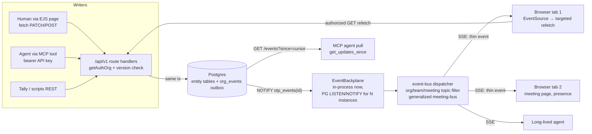

# OTP Real-Time Data Synchronization — Implementation Plan

**Status:** PROPOSED — awaiting David's approval. No feature code written.
**Date:** 2026-06-12
**Goal:** When any agent or human publishes a claim, captures a correction, or changes the org chart / scorecard / todos / meeting state, every other connected agent and org sees the change live — no manual refresh, no lost updates.

---

## PHASE A — Architecture Map (as found)

### A1. Services, languages, deployment

| Component | Details | Evidence |
|---|---|---|
| Web server | Fastify 5.0, TypeScript, Node 20, single process | `src/server.ts` (1,231 lines) |
| Frontend | Server-rendered EJS (184 page views), inline JS, **no bundler/SPA**. Pages call `/api/v1/*` JSON endpoints via `fetch()` | `src/views/`, `src/routes/pages/` |
| DB | PostgreSQL 16 via Drizzle ORM (pool max 10, Railway-aware idle timeout 30s) | `src/config/database.ts` |
| Auth | Clerk (humans, session cookies) + hashed API keys (agents) + legacy-founder path (`organizations.clerkOrgId === auth.userId`) | `src/middleware/auth-helpers.ts`, `api-keys` table |
| MCP server | Separate stdio process (`mcp-server/`); every tool is a thin HTTP client calling `/api/v1/*` with `Authorization: Bearer OTP_API_KEY`. **No direct DB access.** | `mcp-server/src/index.ts` |
| Background work | `node-cron` (lifecycle/onboarding/re-engagement emails) + 60s `setInterval` schedule-runner with **atomic DB row claims** (`UPDATE … RETURNING`) for multi-instance safety | `src/services/schedule-runner.ts:38`, `lifecycle-scheduler.ts` |
| Deploy | Docker multi-stage → Railway (GitHub push to `main`, ~2 min). `min_machines_running=1`; **single instance today**. Health check `GET /health`, restart ON_FAILURE. | `railway.json`, `Dockerfile`, `fly.toml` |
| Second brand | Orger (`orger.ai`) shares the same backend/DB/Clerk | `orger/`, CORS in `server.ts:82-88` |
| Notable absences | **No Redis. No WebSocket lib. No message queue.** SSE is already used (see A4). | `package.json` |

### A2. Data model — where state lives

57 Drizzle tables + 3 raw-SQL graph tables + 1 materialized view, all in Postgres (`src/db/schema.ts`, 1,418 lines). No cache tier; only request-local Maps. Static seed content in `src/data/` (restart to change). Core OTP entities:

| Entity | Tables | Notes |
|---|---|---|
| OOS claims | `oos_files` (versioned per org, status draft/published), `claims` (rule/why/failure_mode, confidence, evidence enums), `claim_similarities` | `oos_files.version` is the only explicit version counter in the system |
| Corrections / learnings | Written as `claims` rows into the org's **draft** OOS via `POST /api/v1/oos/learn` (= MCP `capture_learning`) | schema.ts:129-156 |
| Successes | Same path — claims with a successes section; **no dedicated table** | |
| Org chart | `organizations.chart` (jsonb blob) + `charts` (multi-chart) + `org_members` (seats/roles, `claimed_entity_ids` jsonb) + raw-SQL `graph_nodes`/`graph_edges` (rebuilt from OOS publish) + `seat_responsibilities` | The jsonb blob + derived graph is the trickiest entity for sync |
| Scorecard | `kpis`, `kpi_values` (**unique on `(kpi_id, period_start)`** — natural upsert key), `kpi_dependencies` | schema.ts:740-811 |
| Accountability layer | `todos` (kind personal/l10, delegator fields, append-only `due_at_history`), `rocks` + `rock_milestones`, `tickets` (IDS workflow), `meetings` (status machine + **`scorecard_snapshot`/`rocks_snapshot` jsonb frozen at start**), `meeting_headlines` | schema.ts:893-1127 |
| Cross-org network | `cross_org_edges`, `coordination_patterns` (matview, refreshed on publish), `oos_best_practice_matches`; privacy chokepoint `src/shared/org-visibility.ts` (`is_private`) | |
| Eventing-adjacent | `notifications` (bell), `push_subscriptions` (web push, `public/sw.js`), `audit_logs` (sparse) | Reusable foundations |

**Concurrency controls today:** last-write-wins everywhere. `updated_at` timestamps but **no version columns, no If-Match, no optimistic locking** (except `wallet_ledger` idempotency keys and a few unique indices). Soft deletes (`deleted_at`) and archival (`archived_at`) are distinct.

### A3. Read/write paths per entity (single- vs multi-writer)

Every MCP tool resolves to the same HTTP API the UI uses, so each entity has exactly one write funnel — a major advantage: **instrumenting ~8 route files covers 100% of writers.**

| Entity | Writers | Write paths | Verdict |
|---|---|---|---|
| OOS claims / corrections / successes | Agents (MCP `capture_learning` → `POST /oos/learn`, oos.ts:836), humans (draft editor, `POST /oos`, `POST /oos/:id/publish`) | All funnel through `src/routes/api/oos.ts`; `getAuthOrg()` (Clerk or API key) | **Multi-writer, append-mostly** (concurrent captures append claims; rare true conflicts) |
| Org chart | Founder/admin via `PATCH/POST /api/v1/team/entity` (team.ts:274,308), invites, member edits; graph rebuilt on OOS publish | Discrete per-entity REST ops + one jsonb blob | **Mostly single-writer in practice** (founder), multi-writer capable; blob writes are the lost-update risk |
| Scorecard / KPIs | Humans (dashboard), agents (`update_kpi` MCP → `POST /kpis/:id/values`), Tally's REST pushes | `src/routes/api/kpis.ts`; values upsert on `(kpi_id, period_start)` | **Multi-writer aggregate** — server-authoritative by schema design already |
| Todos / rocks / issues | Humans + agents (MCP add/complete/update tools), public ticket reports | `todos.ts`, `rocks.ts`, `tickets.ts` | **Multi-writer rows**, but each row usually has one owner; field-level collisions rare |
| Meetings | Attendees (notes, headlines, ratings), facilitator (start/end/refresh-scorecard), agents (MCP meeting tools) | `meetings.ts`; status state machine gates transitions | **Multi-writer, highest concurrency surface** (live meeting with N attendees) |

**Auth paths (all must be honored by the live channel):** (1) Clerk session → `getAuthOrg()` for APIs / `l8ResolveOrg()` for pages — these two MUST agree (a past drift let members view pages but not write; caught mid-meeting 2026-05-26); (2) API key → org via `resolveApiKey()`, scoped; (3) legacy founder path; (4) impersonation (`request.orgMember` + `impersonation.as` is the viewer identity — never raw `auth.userId`); (5) meeting reads additionally gated by team membership/attendee list.

### A4. Current data-freshness mechanism

| Surface | Mechanism today | File |
|---|---|---|
| **L8 meeting page** | **SSE already live.** `GET /api/v1/meetings/:id/events` (meetings.ts:753-860) → in-memory `meeting-bus` (`src/services/meeting-bus.ts`) with presence tracking (35s TTL heartbeat). Mutations in meetings/todos/rocks/tickets/headlines routes call `publishMeetingUpdate()` / `publishToTeamMeetings()`. Client (`l8-leadership.ejs:2530`, `strategy-reset-meeting.ejs:1197`): `EventSource` → on `meeting-updated` → debounce 600ms → `snapshotDrafts()` → **`window.location.reload()`** (full page reload — the bus comment marks targeted refresh as the known TODO) | meeting-bus.ts:1-170 |
| Scorecard in meetings | Frozen `scorecard_snapshot` at `/start`; mid-meeting KPI saves re-snapshot (commit 840b1bd fix) and manual `POST /refresh-scorecard` re-syncs; bus event `{kind:'kpi', action:'refreshed'}` | meetings.ts:391,423 |
| Notification bell | **2-minute polling** while tab open | `main.ejs:1007` |
| What's New badge | Fetched once on page load | `main.ejs:1070` |
| Dashboards (/dashboard, /kpis, /team), org chart, OOS browse/search, processes hub | **Request/response only — manual refresh** | — |
| Agents (MCP) | **Pull-only.** `get_my_rules` reads live DB per call, but agents also act from a cached snapshot file (`~/.claude/otp-rules.md`); no push channel exists | mcp-server/src/index.ts:510 |
| Ask-AI / agent runs | SSE streaming (per-request, not pub/sub) | `ask-ai.ts`, `agents.ts:56-71` |
| Web push | Infra exists (`push_subscriptions`, `sw.js`, web-push lib) | server.ts:808-816 |
| Static assets | `/public/*` immutable 1yr; must version via `?v=assetVersion` | server.ts:181-187 |

**Where staleness hurts most, ranked:**
1. **Live L8 meetings** — partially solved, but full-page reload on every change is disruptive (loses scroll/focus; `snapshotDrafts()` papers over draft loss) and the bus dies silently if Railway ever runs >1 instance.
2. **Agents acting on stale rules** — a correction captured by Agent A isn't seen by Agent B until B's next `get_my_rules` pull; the local rules-file cache widens the window. This is the core OTP value loop.
3. **Scorecard concurrent edits** — LWW with no version check; two members editing the same KPI/rock can silently clobber each other. The snapshot-swallows-edits bug class (memory: "check this first when X won't update in my meeting") is a symptom.
4. **Dashboards/org chart** — fully manual refresh; a founder watching the dashboard during the day sees nothing move.
5. **Cross-org network learnings** — new published claims appear only on next pull/browse.

---

## PHASE B — Sync Design Decisions

### B5. Collaboration pattern per entity

| Entity | Pattern | Sync mechanism |
|---|---|---|
| OOS claims / corrections / successes | **Broadcast feed** (append-mostly) | Pub/sub event on create/publish. No conflict strategy needed for appends; claim edits get version-checked LWW. |
| Network learnings (cross-org) | **Broadcast feed** | Same events, fanned to a `network` topic, filtered through `excludePrivateOrgs()` at publish time. |
| Org chart | **Shared mutable document — but edited via discrete REST ops, not free-text co-editing** | Server-authoritative per-entity ops + optimistic version check (409 on stale write). **No CRDT** (see B7). Decompose remaining jsonb-blob writes into per-entity ops or version-gate the blob. |
| Scorecard / KPIs | **Counter/aggregate — server-authoritative deltas** | Upsert on `(kpi_id, period_start)` (already the schema's shape); broadcast `{kpi, period, value}` delta; auto re-snapshot any in-progress meeting on the KPI's team (generalizing the 840b1bd fix). |
| Todos / rocks / issues | **Row-feed with occasional field conflicts** | Broadcast row deltas; optimistic version check on update endpoints; per-field merge unnecessary at current scale. |
| Meetings (state + notes) | **State machine (server-authoritative) + per-segment notes** | Status transitions already gated. Segment notes: per-segment LWW with version + "edited by X" indicator. Revisit CRDT only if real collisions show up in the 409 metrics. |
| Notifications / What's New | **Broadcast feed** | Pure pub/sub; replaces polling. |

### B6. Transport: **SSE (Server-Sent Events)** — generalize what exists

Reasons, tied to this stack:
- **Already proven here 3×** (meeting events, ask-ai streaming, agent-run streaming) including the Fastify `reply.hijack()` + heartbeat patterns and an EJS client with reconnect handling. A WebSocket would be a second, unproven path.
- **Traffic is one-directional.** Every mutation already goes over HTTP POST/PATCH with Clerk cookie or bearer key; the only missing direction is server→client. WebSockets buy nothing.
- **Auth is free.** `EventSource` sends same-origin cookies, so the existing Clerk/`getAuthOrg()`/impersonation middleware applies unchanged. WebSocket upgrade requests need custom auth plumbing.
- **No bundler.** `EventSource` is native browser API; fits the inline-JS EJS architecture. Socket.io et al. want a client library.
- **Built-in reconnect + `Last-Event-ID`** gives us the catch-up/resync hook (B9) for free.
- **WebRTC: rejected** — peer-to-peer is pointless for server-authoritative org data.

**Host keep-alive constraints (Railway):** Railway's edge proxy supports long-lived HTTP but idle connections are cut (observed behavior; exact timeout undocumented — open question Q3). Mitigation: server sends an SSE comment heartbeat every **25s** (the meeting bus's presence TTL is already 35s, so this slots in); client treats `error` + reopen as normal. Also: `Connection: keep-alive`, `X-Accel-Buffering: no`, disable Fastify compression on the stream, and set the DB pool aside — SSE handlers must **not** hold a pg connection while idle.

Browser connection limits: HTTP/1.1 allows ~6 connections per origin; we use **one stream per tab** (org-scoped, multiplexing all topics) so even several tabs stay safe. Railway serves HTTP/2 at the edge, which removes the limit anyway (verify — Q3).

### B7. Conflict strategy: **versioned LWW (optimistic concurrency), no CRDT**

- **CRDT (Yjs/Automerge) rejected:** OTP has no character-level co-editing surface. All writes are discrete REST operations on rows (PATCH a rock, save a KPI value, add a claim). CRDTs would require a client document runtime (against the no-bundler architecture), a persistence rewrite (jsonb → CRDT blobs), and buy nothing for row-shaped data. OT likewise.
- **Chosen:** add `version integer NOT NULL DEFAULT 1` to `rocks`, `todos`, `tickets`, `kpis`, `meetings`, and the chart-entity write path. `PATCH`/`PUT` accept `expectedVersion` (header `If-Match` or body field); `UPDATE … SET version = version + 1 WHERE id = $1 AND version = $2`; zero rows → **409** with the current row in the response so the client can show "changed by {actor} — review and retry." Omitting `expectedVersion` preserves today's LWW (backward compatible; agents migrate later).
- **Per entity:** claims (appends — no check needed; edits version-checked), KPIs (definition edits version-checked; **values** are upserts on the unique period key — inherently conflict-free, latest entry wins by design with `entered_by`/`entered_at` audit), chart (version-check per entity op; forbid whole-blob replace once decomposed), meeting status (state machine + version), segment notes (version per segment key inside the jsonb, checked server-side).
- **Lost-update telemetry:** count 409s per entity. If meeting segment notes show real contention, that is the one candidate for a richer merge later — decided by data, not speculation.

### B8. Multi-instance fan-out: **Postgres LISTEN/NOTIFY under the existing bus seam (no Redis yet)**

`meeting-bus.ts` was deliberately written so "the swap is mechanical" — keep `publish*/subscribe*` and put a backplane underneath:

1. **Outbox table** `org_events` (`id bigserial PK, org_id, team_id, topic, entity_type, entity_id, action, actor_type, actor_id, payload jsonb, created_at`) — written **in the same transaction** as each mutation. This is simultaneously: the durable event log, the `Last-Event-ID` replay source, the agent delta-cursor source, and a real audit trail (today's `audit_logs` is sparse).
2. **Backplane interface** `EventBackplane { publish(eventId), subscribe(cb) }` with two impls: `InProcessBackplane` (today, default) and `PgNotifyBackplane` (`NOTIFY otp_events, '<id>'`; each instance LISTENs on one **dedicated** pg client outside the pool, fetches the row by id, fans out to its local SSE subscribers). NOTIFY's 8KB payload limit is irrelevant since we send only the id.
3. **Why not Redis now:** Railway runs one instance; PG LISTEN/NOTIFY adds zero infra, zero new failure modes, and comfortably handles this event volume (tens/sec at most). The backplane interface makes Redis a drop-in later if NOTIFY throughput or connection pressure ever becomes real. Presence (ephemeral, 35s TTL) also rides the backplane via lightweight presence events — or, simpler, presence remains instance-local until we actually run >1 instance (flagged as an accepted limitation in Phase R4).

### B9. Live-channel auth, tenancy, reconnect

- **Endpoint:** `GET /api/v1/events/stream` (org-scoped; optional `?topics=` filter). Auth = the **API resolver** (`getAuthOrg()`), which already handles Clerk session, API key, and legacy founder. The subscription's org is fixed at connect time from the resolved org — never from a client-supplied param. Meeting topic subscriptions additionally re-check the existing team/attendee gate (reuse the `checkMeetingEdit`/read logic from meetings.ts).
- **Viewer identity** = `request.orgMember` + impersonation state (per the standing rule: never raw `auth.userId`). Page resolver / API resolver parity is a named test case.
- **Tenancy:** every event row carries `org_id`; the dispatcher delivers only to subscribers whose resolved org matches. Team-scoped events (`team_id` set) are filtered against the subscriber's team memberships at delivery. Cross-org `network` topic events are emitted **only** at publish-time through the `excludePrivateOrgs()` / `isCrossOrgVisible()` chokepoint — a private org's claims never enter the network topic at all (enforce-at-write, not filter-at-read).
- **Payload discipline:** events carry **ids + minimal hints, not full records** ("thin events"). Clients refetch through the normal authorized GET endpoints, so the event channel can never leak more than the REST API already allows. This also sidesteps per-field authz on the stream.
- **Reconnect / catch-up:** browser auto-reconnects with `Last-Event-ID`. Server replays `org_events WHERE id > $last AND org_id = $org ORDER BY id LIMIT 500`. If the gap exceeds the replay window (retention or limit), send `event: resync` → client refetches page state (initially: reload; later: targeted refetch). Mid-stream session expiry: reconnect gets 401 → client redirects to sign-in.
- **Agents:** MCP stays pull-based (stdio sessions are ephemeral), but gets cheap freshness: `GET /api/v1/events?since=<cursor>` (same outbox, bearer-key auth) and a new MCP tool `get_updates_since` so an agent can ask "what changed since my last run?" in one call instead of re-pulling everything. Long-lived agent processes may consume the SSE stream directly with their API key.

### Proposed event flow

---

## PHASE C — Phased Rollout Plan

Each phase ships value alone, is flag-gated, and degrades to current behavior when off.

### R0 — Outbox foundation (no user-visible change) — ✅ SHIPPED 2026-06-13
- **Changes:** new `org_events` table (Drizzle def in `src/db/schema.ts` + `src/db/ensure-org-events.ts` boot self-heal, wired into `server.ts`); `bigserial` id as the monotonic replay cursor. Pure builder + types in `src/shared/org-event-types.ts` (DB-free, unit-testable). Writer in `src/services/org-events.ts` with two call patterns: `emitOrgEvent(tx, …)` (throws → rolls back inside an existing transaction) and `emitOrgEventSafe(…)` (best-effort beside bare inserts, swallows + logs, never breaks the mutation). Retention prune + daily cron in `src/services/org-events-retention.ts`. All 8 funnels instrumented beside their existing audit/meeting-bus calls: `oos.ts` (claim captured best-effort + publish atomic-in-tx), `rocks.ts` (create/update/delete), `todos.ts` (create/update/delete, personal + l10), `tickets.ts` (create/update/solve), `meetings.ts` (started/refreshed/ended/updated), `headlines.ts` (created), `kpis.ts` (kpi created + value recorded), `team.ts` (chart entity create/update/delete).
- **Flag:** `ORG_EVENTS_ENABLED` (default OFF — emit is a no-op until flipped, so the instrumentation ships inert). Plus `ORG_EVENTS_RETENTION_DAYS` (default 30) and `ENABLE_ORG_EVENTS_RETENTION` (prod-on). All in `env.template`.
- **Tests:** `src/shared/org-event-types.test.ts` (6 DB-free builder tests) + `src/services/org-events.test.ts` (8 pglite-harness tests: flag gate, normalized insert, monotonic ids, malformed-drop, best-effort error swallow, **same-tx rollback atomicity**, retention prune). Full suite green: 429/429, typecheck + lint clean.
- **Not yet emitted (deliberate, fast-follow):** lower-priority variants — todo promote/demote, rock archive toggle, kpi definition update/delete, member invite/role edits, meeting delete/cascade. The helper is ready; these are one-line additions when R2 consumers need them.
- **Rollback:** flip `ORG_EVENTS_ENABLED=false`; table goes inert (retention still drains it).

### R1 — Generalized event bus + org SSE stream — ✅ SHIPPED 2026-06-13
- **Deviation from original plan (intentional, lower-risk):** rather than *extract* `meeting-bus.ts` into `event-bus.ts` (which would touch the live `/l8/meeting/:id` presence channel — "must be flawless"), R1 *adds* a separate `src/services/event-bus.ts` (org+topic in-process pub/sub) alongside the untouched meeting-bus. They're distinct concerns: org-wide topic firehose vs per-meeting room+presence. Unifying them (meeting rooms as topics) stays available as a later refactor; the additive route delivers R1's value with near-zero blast radius.
- **Changes:** `src/services/event-bus.ts` (pure, DB-free, unit-testable; `subscribeToOrgEvents`/`publishOrgEvent`/topic filter/counts/frame format). `services/org-events.ts` now (a) returns the inserted envelope from `emitOrgEvent`, (b) publishes to the bus from `emitOrgEventSafe` after commit, and (c) exposes `getOrgEventsSince(orgId, sinceId, limit, topics?)` for replay with overflow detection. The oos publish path publishes its envelope **after** the tx commits (no phantom on rollback). New `GET /api/v1/events/stream` (`src/routes/api/events.ts`): `getAuthOrg()` auth (inherits Clerk session, API key, legacy-founder, **and impersonation** — the resolver already handles the Victor/Open Skies impersonation-wins fix), `?topics=` filter, 25s heartbeat, `Last-Event-ID` (header or `?lastEventId=`) replay, **subscribe-before-replay buffering so no event is lost in the gap**, `resync` on overflow/replay-failure, per-org (50) + global (2000) connection caps → 503. Registered in `server.ts`.
- **Flag:** `REALTIME_STREAM_ENABLED` (default OFF → route 404s; inert on ship). Plus `REALTIME_PER_ORG_CAP`/`REALTIME_GLOBAL_CAP`. Pairs with `ORG_EVENTS_ENABLED` (no events emitted → stream carries nothing).
- **Tests (+25, suite 454/454):** `event-bus.test.ts` (DB-free: deliver/filter/unsubscribe/counts, **org-A-never-gets-org-B tenancy**, dead-subscriber isolation, frame format); `events.test.ts` (pure: `parseLastEventId` header/query precedence, flag gate); `org-events.test.ts` additions (emit returns envelope, **emitOrgEventSafe→bus tenancy**, `getOrgEventsSince` cursor/order/topic-filter/**cross-org isolation**/overflow). The hijacked socket handler isn't inject-testable (same as the existing meeting SSE endpoint), so its plumbing mirrors that proven endpoint and its pure pieces are unit-covered.
- **Rollback:** flag off → endpoint 404s; meeting bus continues exactly as today; emit still writes the outbox (R0) but publishes to a bus with zero subscribers (no-op).

### R2 — UI consumers, incremental (highest visible value) — shippable per-surface
**R2.1 — foundation + first live consumer — ✅ SHIPPED 2026-06-13**
- `public/js/otp-live.js`: shared, resilient `EventSource` client (`OTPLive.subscribe({ topics, onEvent, onResync })`). One stream per page; browser handles reconnect + Last-Event-ID. Gated on `window.OTP_REALTIME_ENABLED` (server-rendered from `REALTIME_STREAM_ENABLED` **&&** an authed viewer); on 404/401 it stops after a few tries so consumers fall back to polling — no reconnect storm. Loaded in `main.ejs` `<head>` (versioned `?v=assetVersion`) before body scripts. `realtimeStreamEnabled` added to the global view locals in `server.ts`.
- **Notification bell live:** subscribes via OTPLive and refetches the bell (debounced 500ms) the instant anything changes; the 2-min poll stays as the fallback, so behaviour is identical when the stream is off. Because the same mutations that emit events also create notifications (e.g. a delegated todo → `todo` event + a notification row), an open tab now lights up the bell in ~1s instead of up to 2 min.
- Verified: `node --check` + `ejs.compile` + XSS-lint clean; suite 454/454; typecheck + lint clean. Inert in prod until `REALTIME_STREAM_ENABLED` is flipped.

**R2.2 — Daily dashboard goes live — ✅ SHIPPED 2026-06-13**
- The `/dashboard` (dashboard-daily.ejs) now reacts to remote changes: a guarded live auto-refresh subscribes via `OTPLive` and, on a relevant event (`todo`/`rock`/`kpi`/`issue`/`meeting`), debounces 1.5s and reloads — but **never mid-edit**: if a field is focused or the add-to-do form is open it shows a "Refresh for new updates" pill and applies once idle. The page already `reload()`s after the viewer's own mutations, so this is symmetric, not a new disruption. Gated by `OTPLive` (no-op when the stream is off). Directly fixes the two-browser test: an idle second tab now updates ~1.5s after a teammate/agent change.
- **Design call (important):** this is a *guarded reload*, NOT per-section targeted-swap. The dashboard binds all its interactivity at page load (dozens of `querySelectorAll().forEach(addEventListener)` blocks) with no re-init path, so an `innerHTML` section swap would silently kill those handlers (the "dead controls" failure mode). True targeted-swap is gated on first refactoring that JS to a re-callable init (or event delegation) + extracting section partials + fragment endpoints — a larger, riskier change to the daily driver, deferred deliberately.

**R2.3 — L8 meeting page: Issues section live-swaps (no reload) — ✅ SHIPPED 2026-06-13**
- The `/l8/meeting/:id` page no longer full-reloads when a teammate changes an **issue**. The Issues (`#ids`) section now updates in place: on a `meeting-updated` event with `kind === 'issue'`, the client fetches the page, lifts out the fresh `#ids`, and swaps it (`refreshIssuesSection`). **Every other kind still reloads** (the safe fallback), and any fetch/parse failure falls back to the same reload — so nothing regresses.
- **The enabling refactor:** all Issues handlers (IDS status, solve/convert/edit/delete/reopen/move-team, AND the add-issue form, which lives inside `#ids`) were converted from per-element bind-at-load to **event delegation on document**. Delegated handlers read state from the closest `[data-ticket-id]` card (never a baked closure — verified Issues had no `attendees`-style trap), so the freshly-swapped nodes work with zero rebinding. Mid-edit guard: if you're typing inside `#ids` the swap defers to focusout; editing any other section is undisturbed.
- This was deliberately the FIRST section because its handlers are DOM-driven and self-contained. Other sections (rocks/scorecard/headlines/todos) keep reloading until each gets the same delegation treatment.
- Validated: EJS compile + JS-syntax check of the script + suite 454/454. The real proof is a live two-browser L10 — reload fallback makes a bad swap degrade to today's behavior, not a break.

**R2.4 — L8 meeting Rocks section live-swaps (no reload) — ✅ SHIPPED 2026-06-13**
- Same pattern as Issues, applied to the Rocks (`#rocks`) section: on a `meeting-updated` event with `kind === 'rock'`, swap just `#rocks` (`refreshRocksSection`) instead of reloading; every other kind still reloads; fetch failure falls back to reload.
- All rock handlers delegated on document: On/Off toggle (with in-place badge/button/"changed this meeting" repaint), Complete/Archive/Reopen, due-date, move-to-team, manual ordering, the milestone `.ms-check` check-off, AND the add-priority form (inside `#rocks`). All DOM-driven, no stale-closure trap. Mid-edit guard scoped to `#rocks`.
- Because the swap re-fetches the full page, the swapped `#rocks` includes milestones (the agenda endpoint's missing-milestones gap doesn't apply). Note: milestone check-offs by a teammate still don't auto-refresh — `milestones.ts` emits no meeting-bus event (true before this change too; no regression).
- Validated: EJS compile + JS-syntax check + suite 454/454.

**R2.5 — L8 meeting Scorecard section live-swaps (no reload) — ✅ SHIPPED 2026-06-13**
- On a `meeting-updated` event with `kind === 'kpi'`, swap just `#scorecard` (`refreshScorecardSection`) instead of reloading; every other kind reloads; fetch failure falls back to reload.
- Delegated on document: KPI cell edit (display→edit, cancel, save with in-progress re-snapshot), the `↻ Refresh` (`#refresh-scorecard`) button (lives inside `#scorecard`), and the flag-KPI buttons.
- **Shared flag-to-issue form hardened.** `#flag-issue-form` lives between `#ids` and `#conclude` (outside every section), but `openFlagForm` relocates it into `#scorecard`/`#headlines`. New `rehomeFlagForm()` moves it back home before ANY section swap, so a swap can't destroy it — and the flag buttons are now delegated. This retroactively hardens the `#ids`/`#rocks` swaps too. The form's own Create/Cancel handlers reference the stable form, so they didn't need changing.
- Validated: EJS compile + JS-syntax check + suite 454/454.

**Remaining R2 surfaces (R2.6+, not yet built):**
1. **Extend live-swap to headlines + todos** — same delegation-then-swap pattern, reload fallback for the rest. (Segue/conclude are lower-churn; reload is fine there.)
2. **Dashboard true per-section swap** (currently guarded reload, R2.2) — same pattern once its JS is delegated.
3. **Scorecard auto re-snapshot:** on a KPI value save (incl. agent/Tally pushes) for a team with an in-progress meeting, server re-snapshots + publishes — generalizes the 840b1bd in-meeting-edit fix to ALL value writes.
- **Rollback:** per-surface; each consumer no-ops/reloads when the stream is absent.

### R3 — Conflict safety (no lost updates) — ~4-5 days
- **Changes:** `version` columns (additive, default 1) on rocks/todos/tickets/kpis/meetings + chart entity ops; `expectedVersion` honored on update endpoints (absent → legacy LWW, log it); 409 responses carry the fresh row + last actor; UI conflict treatment (inline "changed by X — reload values / overwrite"); MCP update tools send the version they read. Decompose or version-gate the `organizations.chart` blob write.
- **Test:** concurrency suite — two writers, stale second write → 409; KPI value upsert race on `(kpi_id, period_start)`; meeting double-start idempotency; Playwright two-browser meeting test (A adds issue → B sees it < 2s without reload; A and B edit same rock → second gets conflict UI).
- **Rollback:** stop sending `expectedVersion`; columns are inert.

### R4 — Multi-instance backplane — ~3-4 days (only when scaling is actually planned)
- **Changes:** `PgNotifyBackplane` behind the interface (dedicated LISTEN client with reconnect/backoff outside the pool); flag `EVENT_BACKPLANE=pg|memory`; presence either rides the backplane or is documented instance-local. Verify the cron/scheduler single-runner story holds at N instances (schedule-runner is already safe via atomic claims; lifecycle crons need a leader flag or instance-0 env gate).
- **Test:** two local processes against one Postgres (docker-compose) — publish on A, deliver on B; NOTIFY client kill/reconnect.
- **Rollback:** `EVENT_BACKPLANE=memory`.

### R5 — Agent + network freshness — ~3-4 days
- **Changes:** `GET /api/v1/events?since=<id>` cursor endpoint (bearer auth, org-scoped); MCP tools `get_updates_since` and freshness metadata (`rules_version` / latest event id) on `get_my_rules` so the local `otp-rules.md` cache can self-invalidate; `network` topic events emitted at publish through the privacy chokepoint (cross-org claim published → connected orgs' streams + agent cursors see it); optional web-push for offline founders (infra already present).
- **Test:** privacy — flip an org to `is_private` mid-stream and assert no further network events; cursor pagination.

**Total: roughly 3.5-4.5 weeks of focused work, with user-visible value landing at R2.1 (~end of week 2).**

### Backward compatibility
- All changes additive: new table, new columns with defaults, new endpoints. No existing endpoint changes shape.
- Clients without SSE: everything still works request/response; polling fallbacks retained.
- Old MCP server versions: unaffected (no tool signatures change; new tools are additions).
- `meeting-bus` public surface preserved through the R1 refactor — its call sites don't change.

### Testing strategy (cross-cutting)
- Unit: event builders, replay-window math, topic filtering — all in DB-free modules (hard project constraint: anything importing `config/database.ts` throws without `DATABASE_URL`).
- Integration: Fastify inject for SSE handshake/heartbeat/replay/authz; tx-atomicity of outbox writes (docker-compose Postgres, the existing vitest pattern).
- Concurrency: the R3 suite above; soak test holding 200 SSE connections while publishing 10 events/sec, watching pool usage (SSE handlers must hold no pg connection while idle — pool max is 10).
- E2E: Playwright two-browser meeting scenario; manual prod verification limited by the known Clerk-headless constraint (David supplies authed checks; `/demo-login` org can exercise the stream unauthenticated-ish).

### Observability
- Counters: active SSE connections (gauge, per instance), events published/delivered/dropped, replays served, `resync`s issued, 409 conflicts per entity, heartbeat write failures.
- `/admin/health` tile: connections, events/min, outbox lag (now − max delivered id age), retention status.
- Structured logs sampled on subscribe/unsubscribe/replay; alert (ntfy) if outbox writes fail or LISTEN client flaps.

### Risks
| Risk | Mitigation |
|---|---|
| Railway proxy kills idle SSE | 25s heartbeats; reconnect-with-replay is a designed path, not an error |
| Connection exhaustion (many tabs/orgs) on one dyno | One stream per tab; per-org + global caps; gauge + alert; Node handles thousands of idle sockets, pg pool is the real ceiling — keep handlers DB-free while idle |
| Event storms (bulk import, Ninety importer) | Per-tx event coalescing for bulk ops (one `bulk` event, clients refetch); rate-limit dispatcher |
| Reload-replacement regressions on the meeting page (its inline JS is large and draft-snapshot logic is delicate) | Ship per-`kind` incrementally with reload fallback; Playwright coverage before removing reload |
| `org_events` growth | 30-day retention cron; id-based pruning is cheap; replay window documented |
| 409s annoy users if too aggressive | Version checks opt-in per endpoint; telemetry first, tighten later |
| Two-product surface (Orger) accidentally exposed | Stream endpoint org-scoped by resolver; Orger simply doesn't subscribe in v1 |
| CSP blocks EventSource | Same-origin — no CSP change needed; verify `connect-src` includes 'self' (it does for existing fetch/SSE) |

### Open questions for David
1. **Scale intent:** is multi-instance Railway actually on the horizon? If not, R4 stays parked and we save ~4 days.
2. **Agent push:** do any agents run long-lived enough to hold an SSE stream, or is the cursor pull (`get_updates_since`) sufficient for the army? (I assumed cursor-pull is enough for v1.)
3. **Railway specifics to verify empirically in R1:** edge idle-timeout for SSE, HTTP/2 at the edge (affects browser connection limits). One-hour spike test answers both.
4. **Meeting notes contention:** accept per-segment versioned LWW with an "edited by X" indicator, or is simultaneous typing in the same segment a real workflow we must merge? (I assumed indicator + 409 is fine; the metrics will tell us.)
5. **Retention:** 30 days of `org_events` OK? (Doubles as audit trail — arguably keep longer.)
6. **Orger:** should orger.ai get live updates in v1? (I assumed no.)

### Assumptions made
- Single Railway instance today (per `meeting-bus.ts` comment and `fly.toml` min=1); prod deploys via GitHub push to main.
- The MCP server has no direct DB access (verified: it's an HTTP client) — so instrumenting the HTTP layer covers agents completely.
- "Successes" continue living as claims (no dedicated table) — events treat them as claim events with a section hint.
- Event payloads as thin ids+hints is acceptable latency-wise (one extra GET per update on the client).
- `audit_logs` stays as-is; `org_events` does not replace it formally (though it could later).
- Demo org (`demo_acme`) events flow like any org's; demo-login viewers are org members for stream purposes.
- No CRDT need now; revisit only on 409 evidence.
